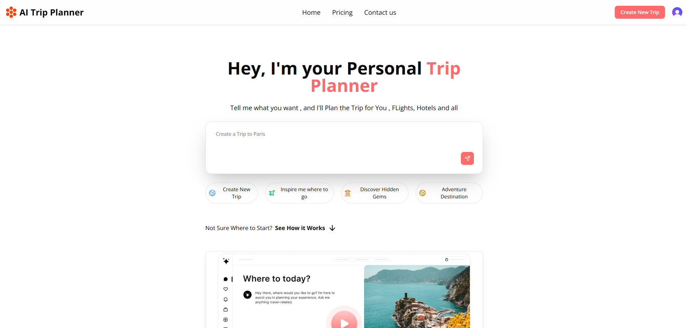
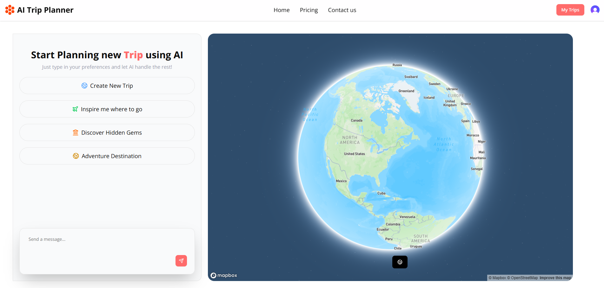
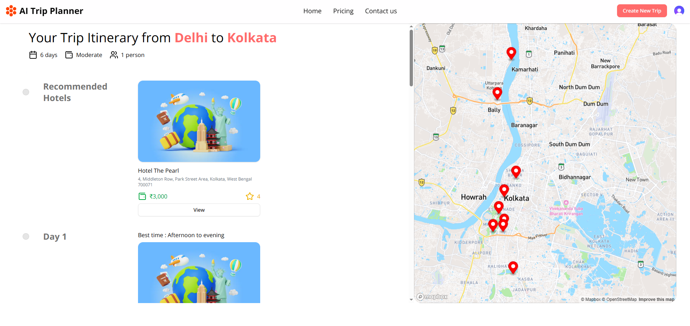
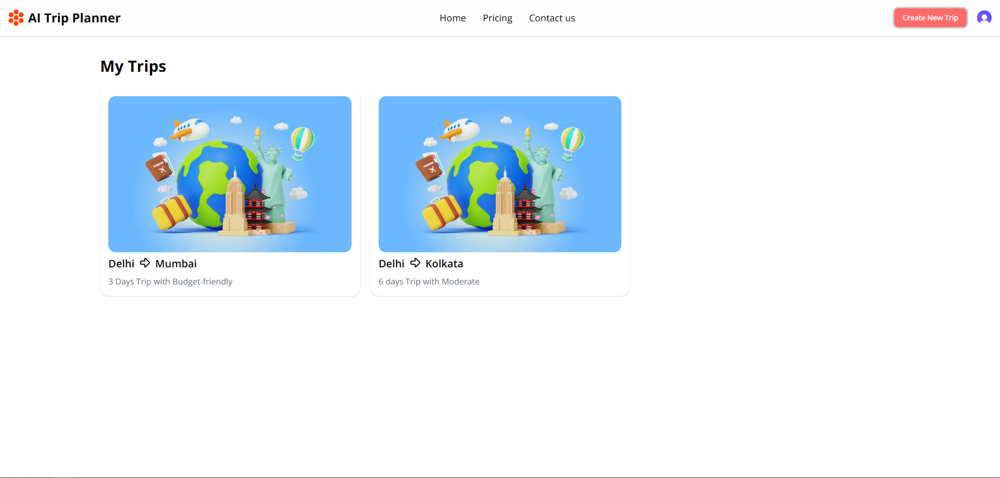

# 🌍 AI Trip Planner

An AI-powered travel planning application that creates personalized trip itineraries through a conversational AI experience. Users simply answer a few questions about their trip, and the application generates a complete travel plan with destinations, hotels, activities, and maps.

> **Live Demo:** https://ai-trip-planner-steel.vercel.app/

---

## ✨ Features

- 🤖 AI-powered conversational trip planning
- 🌍 Personalized travel itinerary generation
- 🏨 Hotel recommendations
- 📍 Places to visit
- 🗺️ Interactive map integration with Mapbox
- 👥 Group-based trip planning
- 💰 Budget selection
- 📅 Trip duration planning
- 🔐 User authentication using Clerk
- 💾 Save and view previously generated trips
- ⚡ Fast and responsive UI
- 🛡️ API protection using Arcjet

---

## 🚀 Tech Stack

### Frontend

- Next.js 15 (App Router)
- React
- TypeScript
- Tailwind CSS
- shadcn/ui
- Magic UI

### Backend

- Next.js API Routes
- Convex Database

### AI

- OpenRouter API
- OpenAI SDK

### Authentication

- Clerk

### Maps

- Mapbox GL

### Deployment

- Vercel

---

## 📸 Screenshots

### Home Page



---

### AI Chat



---

### Generated Itinerary



---

### My Trips



## 🛠 Installation

Clone the repository

```bash
git clone https://github.com/pranshu2108/AI-TRIP-PLANNER.git
```

Move into the project

```bash
cd AI-TRIP-PLANNER
```

Install dependencies

```bash
npm install
```

Start the development server

```bash
npm run dev
```

Open

```
http://localhost:3000
```

---

## 🔑 Environment Variables

Create a `.env.local` file in the root directory.

```env
OPENROUTER_API_KEY=
NEXT_PUBLIC_CLERK_PUBLISHABLE_KEY=
CLERK_SECRET_KEY=

NEXT_PUBLIC_CONVEX_URL=

NEXT_PUBLIC_MAPBOX_ACCESS_TOKEN=

ARCJET_KEY=
```

> Replace the above values with your own credentials.

---

## 📂 Project Structure

```
AI-TRIP-PLANNER
│
├── app
│   ├── api
│   ├── create-new-trip
│   ├── my-trips
│   ├── pricing
│   ├── view-trip
│   └── _components
│
├── components
│
├── convex
│
├── context
│
├── hooks
│
├── lib
│
├── public
│
└── README.md
```

---

## ⚙️ How It Works

1. User signs in using Clerk.
2. AI asks a series of questions about the trip.
3. User provides:
   - Starting location
   - Destination
   - Group size
   - Budget
   - Trip duration
4. The application sends the information to the AI model through the OpenRouter API.
5. AI generates a personalized travel itinerary.
6. The itinerary is stored in Convex.
7. Users can revisit their saved trips anytime.

---

## 🌟 Key Highlights

- Conversational AI workflow
- Structured JSON responses from the AI
- Secure authentication
- Persistent trip storage
- Interactive maps
- Responsive design
- Modern Next.js architecture

---

## 👨‍💻 Author

**Pranshu Sharma**

GitHub: https://github.com/pranshu2108

Project: https://ai-trip-planner-steel.vercel.app/